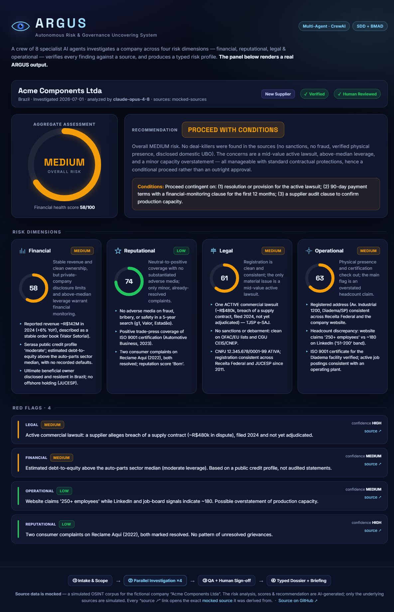

# 🛰️ ARGUS — Autonomous Risk & Governance Uncovering System

> Inspirado no curso **Agentic Software Development — SDD & BMAD** e no **Multi AI Agent Systems with crewAI** como forma de consolidar conhecimento colocando em prática todos os ensinamentos das aulas.

**ARGUS** é uma crew de due diligence corporativa construída sobre [CrewAI](https://crewai.com), projetada para investigar o risco de empresas antes de fechar contratos com fornecedores, parceiros estratégicos, ou alvos de aquisição.

O sistema orquestra 8 agentes especialistas em um processo hierárquico e paralelo, produzindo um **perfil de risco tipado + dossiê + briefing executivo** — sem inventar nada.

<p align="center">
  <a href="https://robertogfortes.github.io/argus-due-diligence/">
    
  </a>
</p>

<p align="center">
  <b><a href="https://robertogfortes.github.io/argus-due-diligence/">🖥️ Ver o dashboard ao vivo</a></b>
  &nbsp;·&nbsp;
  📖 Docs: <a href="docs/ARCHITECTURE.en.md">English</a> · <a href="docs/ARCHITECTURE.pt-br.md">Português</a>
  &nbsp;·&nbsp;
  🧪 <a href="#-preview-do-resultado-sem-api-key">Preview sem API key</a>
</p>

> 💡 **Prévia do processamento:** o dashboard acima renderiza uma **saída real do ARGUS**.
> A **fonte de dados é mockada** (um corpus OSINT simulado de uma empresa fictícia), mas a
> **análise, os scores e a recomendação são gerados por IA** — cada achado é rastreável à
> fonte mockada que o originou. Clicar em qualquer *"source ↗"* abre a
> [fonte mockada dentro do projeto](https://robertogfortes.github.io/argus-due-diligence/sources.html).

---

## 🖼️ Preview do resultado (fontes mockadas, análise real)

Existem **três modos** de rodar o ARGUS:

| Modo | Comando | Fontes | Resultado | Precisa de |
|---|---|---|---|---|
| **Preview** | `python -m argus.demo` | mockadas | análise congelada (a mesma do dashboard) | nada |
| **Mock-sources** | `ARGUS_MOCK_SOURCES=true python -m argus.main` | mockadas | **gerado ao vivo pela IA** | só 1 LLM (OpenAI/Anthropic/**Ollama local grátis**) |
| **Full** | `python -m argus.main` | reais (Serper) | gerado ao vivo pela IA | OpenAI + Serper |

O modo **preview** roda sem configurar nada e produz:

```bash
pip install -e .
python -m argus.demo         # gera outputs/ + dashboard/data/ + dashboard/sources.html
# abra dashboard/index.html no navegador
```

| Arquivo | Conteúdo |
|---|---|
| `outputs/risk_profile.json` | Perfil de risco tipado + metadados (`analysis_model`, `source_mode`) |
| `outputs/due_diligence_dossier.md` | Dossiê completo por dimensão |
| `outputs/risk_briefing.md` | Briefing executivo de 1 página |
| `dashboard/sources.html` | Corpus de fontes mockadas (alvo dos links de evidência) |

> **Sobre os dados:** a **fonte** é um corpus OSINT **simulado** (empresa fictícia "Acme
> Components Ltda") — deixado explícito no dashboard e na página de fontes. A **análise** é
> produzida por um LLM sobre esse corpus; o modelo que processou fica registrado no campo
> `analysis_model` da saída. Para regenerar ao vivo com seu próprio LLM sobre as mesmas
> fontes mockadas: `ARGUS_MOCK_SOURCES=true python -m argus.main`.

> 🧠 **100% local e grátis:** com [Ollama](https://ollama.com) você roda sem nenhuma API key —
> `ARGUS_LLM_MODEL=ollama/llama3.1 ARGUS_LLM_BASE_URL=http://localhost:11434 ARGUS_MOCK_SOURCES=true python -m argus.main`

📋 Cobertura completa dos 35 conceitos do curso: [docs/COVERAGE.md](docs/COVERAGE.md)

---

## 🏗️ Arquitetura

```
Chief Investigation Officer (gerente hierárquico)
│
├── Squad 1 — Intake & Escopo
│   └── Third-Party Risk Intake Analyst
│
├── Squad 2 — Investigação Paralela (async)
│   ├── Forensic Financial Analyst
│   ├── Reputation Intelligence Analyst
│   ├── Legal & Compliance Researcher
│   └── Operational Footprint Analyst
│
├── Squad 3 — Verificação / QA
│   └── Evidence Verification Specialist (human_input=True)
│
└── Squad 4 — Síntese & Relatório
    ├── Risk Dossier Strategist → due_diligence_dossier.md + risk_profile.json
    └── Executive Briefing Editor → risk_briefing.md
```

### Padrões do curso aplicados

| Padrão | Onde vive no ARGUS |
|---|---|
| Role Playing + keywords de domínio | "FINRA-informed Forensic Financial Analyst" |
| Processo **sequencial** | Intake antes de tudo |
| Processo **paralelo** (`async_execution=True`) | 4 investigações simultâneas |
| Processo **hierárquico** (`Process.hierarchical`) | Chief Investigation Officer |
| `context=[tasks]` | QA e síntese consomem todas as saídas |
| **Custom tools** (`BaseTool`) | RedFlagScorer, FinancialHealth, NewsSentiment, EntityConsistency |
| **Pydantic** `output_json` | `CompanyRiskProfile` tipado |
| `human_input=True` | Assinatura humana em achados adversos HIGH |
| **Memory** (`memory=True`) | Aprende padrões entre investigações |
| **Guardrails** (prompt + tool-scoping) | "Sem fonte, o achado não existe" |
| `allow_delegation` | QA delega de volta ao especialista |
| Múltiplos `output_file` | 2 arquivos MD + 1 JSON |
| Pasta de instruções | `./playbooks/` (new_supplier, strategic_partner, acquisition_target) |

---

## 🚀 Quick Start

### 1. Pré-requisitos

- Python 3.10+
- Chave de API da [OpenAI](https://platform.openai.com)
- Chave de API do [Serper](https://serper.dev) (2.500 buscas/mês grátis)

### 2. Instalação

```bash
# Clone o repositório
git clone https://github.com/robertogfortes/argus-due-diligence.git
cd argus-due-diligence

# Crie e ative um ambiente virtual
python -m venv .venv
source .venv/bin/activate        # Linux/macOS
.venv\Scripts\activate           # Windows

# Instale as dependências
pip install -e ".[dev]"
```

### 3. Configuração

```bash
cp .env.example .env
# Edite .env e adicione suas chaves de API
```

Variáveis obrigatórias no `.env`:

```env
OPENAI_API_KEY=sk-proj-...
SERPER_API_KEY=...
```

Variáveis opcionais (já têm valores padrão):

```env
OPENAI_MODEL_NAME=gpt-4o-mini   # agentes especialistas (custo vs. qualidade)
MANAGER_MODEL_NAME=gpt-4o       # Chief Investigation Officer (use modelo mais forte)
AGENT_TEMPERATURE=0.2           # baixo = mais factual (recomendado para due diligence)
ARGUS_VERBOSE=true
ARGUS_MEMORY=true
```

### 4. Executar

Edite os inputs em [src/argus/main.py](src/argus/main.py):

```python
run(
    target_company="Nome da Empresa Ltda",
    company_website="https://www.empresa.com.br",
    engagement_type="new_supplier",          # new_supplier | strategic_partner | acquisition_target
    jurisdiction="Brazil",
    risk_appetite="Medium",                  # Low | Medium | High
    company_size="SME (50-500 employees)",
)
```

Depois execute:

```bash
python -m argus.main
# ou
argus
```

> ⚠️ **human_input**: A investigação pausará na etapa de verificação para revisão humana de achados adversos HIGH. Você verá um prompt no terminal para aprovar ou ajustar os achados antes de prosseguir.

### 5. Saídas

```
outputs/
├── due_diligence_dossier.md    # Dossiê completo com todas as dimensões
├── risk_briefing.md            # Briefing executivo (2 páginas)
└── [risk_profile.json]         # Perfil de risco tipado (Pydantic)
```

---

## 🧪 Testes

```bash
pytest tests/ -v
```

Os testes unitários cobrem todos os modelos Pydantic e as 4 ferramentas customizadas — sem precisar de chaves de API.

---

## 🔧 Ferramentas Customizadas

| Ferramenta | Função |
|---|---|
| `RedFlagScorerTool` | Pontua texto por sinais de risco corporativo (low/medium/high) |
| `FinancialHealthTool` | Score de saúde financeira 0–100 a partir de texto |
| `NewsSentimentTool` | Sentimento de cobertura de mídia (-100 a +100) |
| `EntityConsistencyTool` | Detecta inconsistências em dados de entidade corporativa |

---

## 📁 Estrutura do Projeto

```
argus/
├── src/argus/
│   ├── crew.py              # Wiring da crew hierárquica
│   ├── main.py              # Entry point
│   ├── models/
│   │   └── risk_profile.py  # CompanyRiskProfile (Pydantic)
│   ├── tools/               # 4 ferramentas customizadas (BaseTool)
│   └── config/
│       ├── agents.yaml      # role / goal / backstory de cada agente
│       └── tasks.yaml       # description / expected_output de cada tarefa
├── playbooks/               # Guias de investigação por tipo de engajamento
│   ├── new_supplier.md
│   ├── strategic_partner.md
│   └── acquisition_target.md
├── policies.md              # Políticas internas de risco (consultadas pelo QA via RAG)
├── constitution.md          # Princípios inegociáveis (guardrails)
├── outputs/                 # Saídas geradas (gitignored)
└── tests/                   # Testes unitários (sem API keys)
```

---

## ⚖️ Ética & Escopo

Este projeto implementa due diligence corporativa legítima e padrão de mercado (Third-Party Risk / KYB):

- **Somente dados públicos ou autorizados** — sem invasão ou dados privados de pessoas físicas
- **Escopo corporativo e apolítico** — investiga empresas, não figuras políticas individuais
- **Nunca fabricar** — sem fonte, o achado não existe; incerteza sempre explícita
- **Humano no circuito** — todo achado adverso HIGH requer assinatura humana
- **Auditável** — cada afirmação rastreável até a fonte; specs versionadas no Git

---

## 🎓 Conceitos Aplicados

Este projeto foi construído como projeto de consolidação dos cursos:

- **Agentic Software Development — SDD & BMAD**: uso de `constitution.md`, planejamento em fases (specify → plan → tasks → implement), ciclo ágil com QA, specs como fonte da verdade
- **Multi AI Agent Systems with crewAI**: todos os 6 elementos de um grande agente (Role Playing, Focus, Tools, Cooperation, Guardrails, Memory), os 3 processos (Sequential, Parallel, Hierarchical), Pydantic output, human_input, async_execution, context, custom tools

---

## 📄 Licença

MIT
