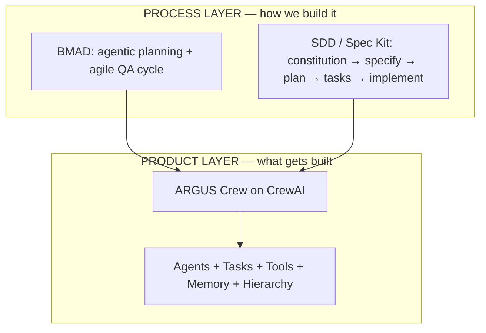
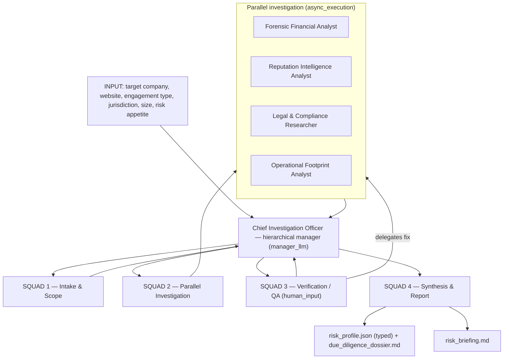
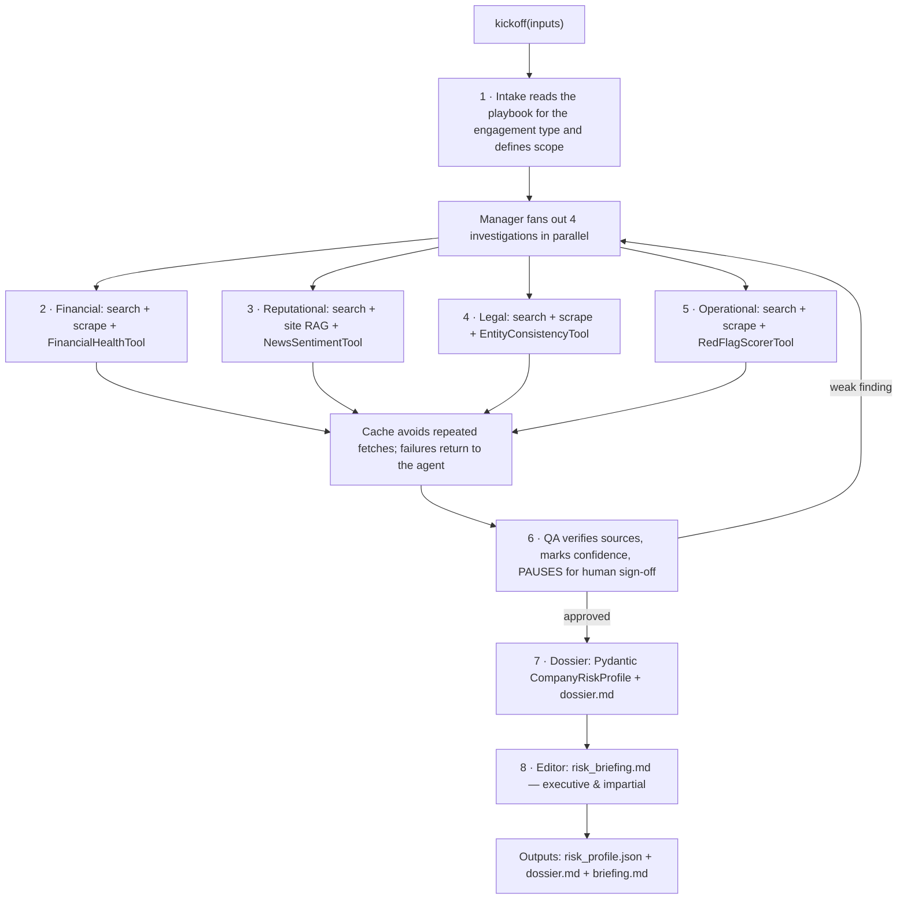
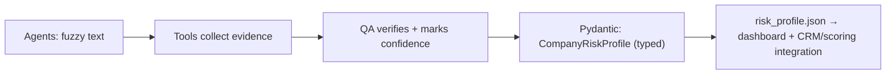

# ARGUS — Architecture & How It Works (English)

🌐 **Languages:** [English](ARCHITECTURE.en.md) · [Português](ARCHITECTURE.pt-br.md)
📊 **Live dashboard:** https://robertogfortes.github.io/argus-due-diligence/

> **ARGUS** = *Autonomous Risk & Governance Uncovering System* — a crew of AI agents
> that investigates the risk of a company before you sign a contract with a supplier,
> strategic partner, or acquisition target. It surfaces hidden red flags (financial,
> legal, reputational, operational) **without inventing anything**.

---

## 1. The two layers

ARGUS separates *how we build* from *what we build*. This is the core idea behind
combining the **SDD (Spec-Driven Development)** and **BMAD** methods with **CrewAI**.



- **Process layer** is the engineering discipline: a `constitution.md` of non-negotiable
  rules, specs as the source of truth, and an agile QA cycle.
- **Product layer** is the running system: the CrewAI crew that does the investigation.

---

## 2. High-level architecture

ARGUS is a **hierarchical crew** coordinated by a **Chief Investigation Officer** (the
manager LLM), organized into 4 squads. Each squad maps to a lesson from the CrewAI course.



**Why hierarchical?** An investigation is *dynamic* — you don't know up front whether
you'll need to dig deeper into finances or litigation. The manager always remembers the
original objective ("is it safe to do business with X?") and decides, at runtime, who
deepens what — even launching an extra investigation if a serious red flag appears.

---

## 3. The execution pipeline (step by step)



The three collaboration modes from the course all appear here:

| Mode | Where in ARGUS | Why |
|---|---|---|
| **Sequential** | Intake before everything | investigations depend on the defined scope |
| **Parallel** (`async_execution`) | the 4 investigations | they're independent → saves time |
| **Context** (`context=[]`) | QA and Synthesis | they wait for and consume prior outputs |
| **Hierarchical** (`Process.hierarchical`) | the whole crew | complex, dynamic flow; manager keeps the goal |

---

## 4. From fuzzy text to a typed result

The bridge between the LLM agents and downstream systems (CRM, scoring engines) is a
**strongly-typed Pydantic model**. No source = no finding; every finding carries a
confidence level.



`CompanyRiskProfile` contains: overall risk, financial score, four per-dimension
assessments (each with a 0–100 score and top findings), a list of red flags (category,
description, severity, **evidence_url**, confidence), verification/human-review flags,
and a final recommendation (`proceed | proceed_with_conditions | decline`).

---

## 5. The four custom tools

Each is a CrewAI `BaseTool` with a typed input schema. The `description` is what the
agent reads to decide when to use it.

| Tool | What it does |
|---|---|
| `RedFlagScorerTool` | Scores operational text for risk signals → low / medium / high |
| `FinancialHealthTool` | Scores financial text 0–100 (distressed → healthy) |
| `NewsSentimentTool` | Sentiment of media coverage, −100 → +100 |
| `EntityConsistencyTool` | Flags corporate-entity inconsistencies & opacity signals |

---

## 6. Guardrails (the "never fabricate" rule)

- **Framework level (CrewAI):** prevents infinite loops, excessive tool use, timeouts.
- **Prompt / custom level (ours):**
  - "Never fabricate findings. Every claim cites a source."
  - "Mark the confidence level; if uncertain, say so."
  - "Use only public or authorized data."
  - **Scope:** no private individuals, no political figures.
  - **Tool-scoping:** `ScrapeWebsiteTool` locked to the official site.
  - **Human gate:** `human_input=True` to sign off adverse findings.

These rules live in [`constitution.md`](../constitution.md) and are cross-referenced by
the QA agent against [`policies.md`](../policies.md).

---

## 7. Three ways to run it

| Mode | Command | Sources | Result | Needs |
|---|---|---|---|---|
| **Preview** | `python -m argus.demo` | mocked | frozen analysis (powers the dashboard) | nothing |
| **Mock-sources** | `ARGUS_MOCK_SOURCES=true python -m argus.main` | mocked | **produced live by the AI** | one LLM (OpenAI / Anthropic / local Ollama) |
| **Full** | `python -m argus.main` | live (Serper) | produced live by the AI | OpenAI + Serper |

**Sources mocked, result real.** In mock-sources mode, only the raw search/scrape lookups are
faked (via `argus.mock_sources`); the agents and the LLM still perform genuine analysis. The
model that produced the analysis is recorded in the output's `analysis_model` field, and every
finding links to the exact mocked source it came from
([sources page](https://robertogfortes.github.io/argus-due-diligence/sources.html)).

**Run it free & local** with [Ollama](https://ollama.com) — no API key at all:

```bash
ARGUS_LLM_MODEL=ollama/llama3.1 ARGUS_LLM_BASE_URL=http://localhost:11434 \
  ARGUS_MOCK_SOURCES=true python -m argus.main
```

Open [`dashboard/index.html`](../dashboard/index.html) locally, or see the
[live dashboard](https://robertogfortes.github.io/argus-due-diligence/).

> Full concept coverage (all 35 course concepts): [COVERAGE.md](COVERAGE.md).
