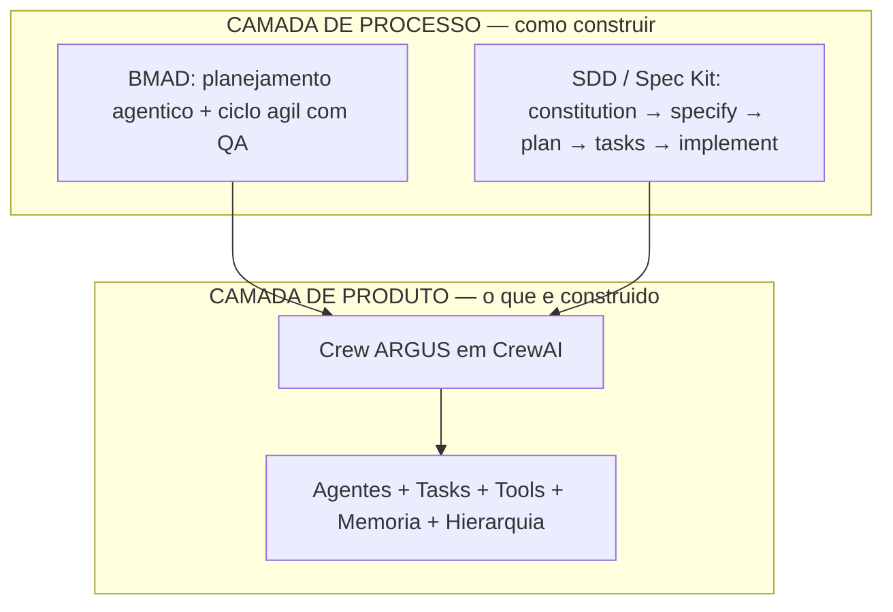
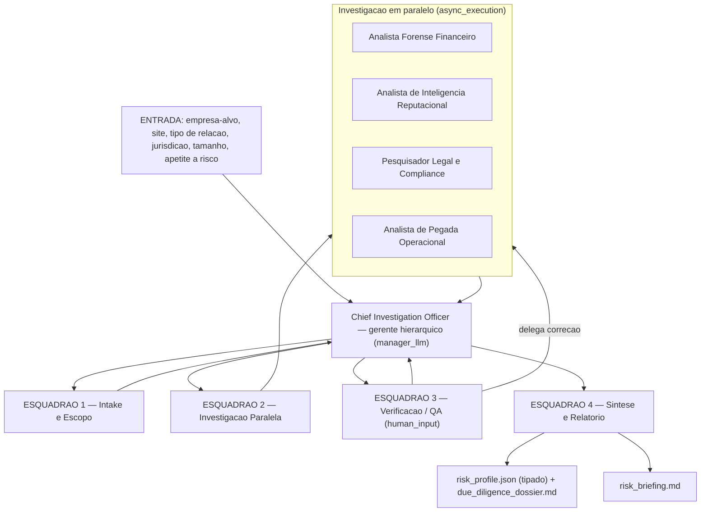
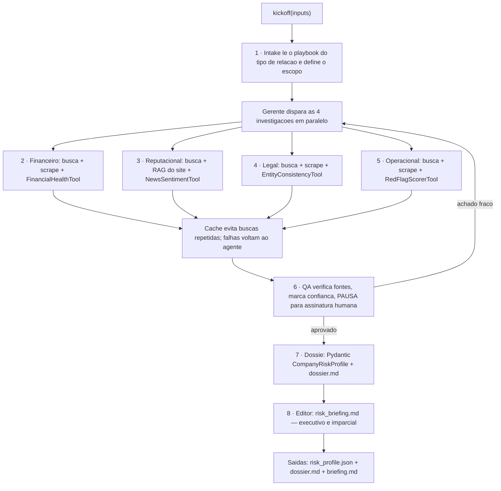
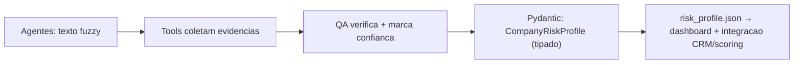

# ARGUS — Arquitetura & Como Funciona (Português)

🌐 **Idiomas:** [English](ARCHITECTURE.en.md) · [Português](ARCHITECTURE.pt-br.md)
📊 **Dashboard ao vivo:** https://robertogfortes.github.io/argus-due-diligence/

> **ARGUS** = *Autonomous Risk & Governance Uncovering System* — uma crew de agentes de IA
> que investiga o risco de uma empresa antes de você fechar contrato com um fornecedor,
> parceiro estratégico ou alvo de aquisição. Ela revela *red flags* escondidos (financeiros,
> legais, reputacionais e operacionais) **sem inventar nada**.

---

## 1. As duas camadas

O ARGUS separa *como construímos* de *o que construímos*. Essa é a ideia central por trás
da combinação dos métodos **SDD (Spec-Driven Development)** e **BMAD** com o **CrewAI**.



- A **camada de processo** é a disciplina de engenharia: uma `constitution.md` de regras
  inegociáveis, especificações como fonte da verdade e um ciclo ágil com QA.
- A **camada de produto** é o sistema em execução: a crew CrewAI que faz a investigação.

---

## 2. Arquitetura de alto nível

O ARGUS é uma **crew hierárquica** coordenada por um **Chief Investigation Officer** (o LLM
gerente), organizada em 4 esquadrões. Cada esquadrão mapeia uma lição do curso de CrewAI.



**Por que hierárquico?** Uma investigação é *dinâmica* — você não sabe de antemão se vai
precisar aprofundar em finanças ou em litígios. O gerente sempre lembra o objetivo original
("é seguro fechar negócio com X?") e decide, em tempo de execução, quem aprofunda o quê —
inclusive disparando uma investigação extra se um red flag grave aparecer.

---

## 3. O pipeline de execução (passo a passo)



Os três modos de colaboração do curso aparecem todos aqui:

| Modo | Onde no ARGUS | Por quê |
|---|---|---|
| **Sequencial** | Intake antes de tudo | as investigações dependem do escopo definido |
| **Paralelo** (`async_execution`) | as 4 investigações | são independentes → economiza tempo |
| **Context** (`context=[]`) | QA e Síntese | esperam e consomem as saídas anteriores |
| **Hierárquico** (`Process.hierarchical`) | a crew inteira | fluxo complexo e dinâmico; gerente lembra o objetivo |

---

## 4. Do texto "fuzzy" ao resultado tipado

A ponte entre os agentes LLM e sistemas tradicionais (CRM, motores de scoring) é um
**modelo Pydantic fortemente tipado**. Sem fonte, não há achado; todo achado carrega um
nível de confiança.



O `CompanyRiskProfile` contém: risco geral, score financeiro, quatro avaliações por dimensão
(cada uma com score 0–100 e principais achados), uma lista de red flags (categoria, descrição,
severidade, **evidence_url**, confiança), flags de verificação/revisão humana, e uma
recomendação final (`proceed | proceed_with_conditions | decline`).

---

## 5. As quatro ferramentas customizadas

Cada uma é uma `BaseTool` do CrewAI com schema de entrada tipado. A `description` é o que o
agente lê para decidir quando usá-la.

| Ferramenta | O que faz |
|---|---|
| `RedFlagScorerTool` | Pontua texto operacional por sinais de risco → low / medium / high |
| `FinancialHealthTool` | Pontua texto financeiro 0–100 (distress → saudável) |
| `NewsSentimentTool` | Sentimento da cobertura de mídia, −100 → +100 |
| `EntityConsistencyTool` | Sinaliza inconsistências e opacidade de entidade corporativa |

---

## 6. Guardrails (a regra "nunca fabricar")

- **Nível framework (CrewAI):** previne loops infinitos, uso excessivo de tool e timeout.
- **Nível prompt / custom (nosso):**
  - "Nunca fabricar achados. Toda afirmação cita fonte."
  - "Marque o nível de confiança; se estiver incerto, diga."
  - "Use apenas dados públicos ou autorizados."
  - **Escopo:** sem indivíduos privados, sem figuras políticas.
  - **Tool-scoping:** `ScrapeWebsiteTool` travado no site oficial.
  - **Gate humano:** `human_input=True` para assinar achados adversos.

Essas regras vivem em [`constitution.md`](../constitution.md) e são cruzadas pelo agente de
QA contra [`policies.md`](../policies.md).

---

## 7. Três formas de executar

| Modo | Comando | Fontes | Resultado | Precisa de |
|---|---|---|---|---|
| **Preview** | `python -m argus.demo` | mockadas | análise congelada (alimenta o dashboard) | nada |
| **Mock-sources** | `ARGUS_MOCK_SOURCES=true python -m argus.main` | mockadas | **produzido ao vivo pela IA** | 1 LLM (OpenAI / Anthropic / Ollama local) |
| **Full** | `python -m argus.main` | reais (Serper) | produzido ao vivo pela IA | OpenAI + Serper |

**Fontes mockadas, resultado real.** No modo mock-sources, apenas as buscas/scrapes são
simuladas (via `argus.mock_sources`); os agentes e o LLM realizam análise genuína. O modelo
que produziu a análise é gravado no campo `analysis_model` da saída, e cada achado aponta para
a fonte mockada exata que o originou
([página de fontes](https://robertogfortes.github.io/argus-due-diligence/sources.html)).

**Rode grátis e local** com [Ollama](https://ollama.com) — sem nenhuma chave de API:

```bash
ARGUS_LLM_MODEL=ollama/llama3.1 ARGUS_LLM_BASE_URL=http://localhost:11434 \
  ARGUS_MOCK_SOURCES=true python -m argus.main
```

Abra o [`dashboard/index.html`](../dashboard/index.html) localmente, ou veja o
[dashboard ao vivo](https://robertogfortes.github.io/argus-due-diligence/).

> Cobertura completa (todos os 35 conceitos do curso): [COVERAGE.md](COVERAGE.md).
